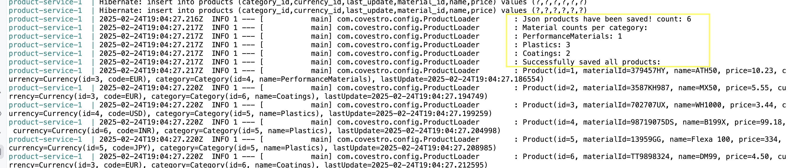
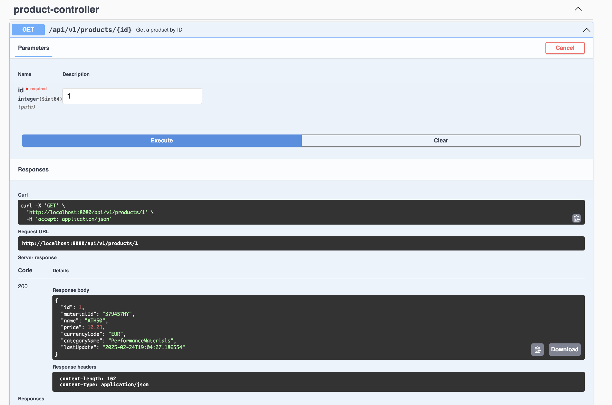
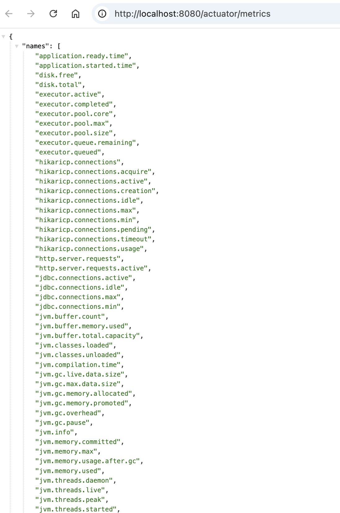
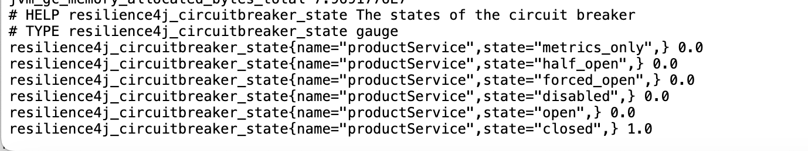
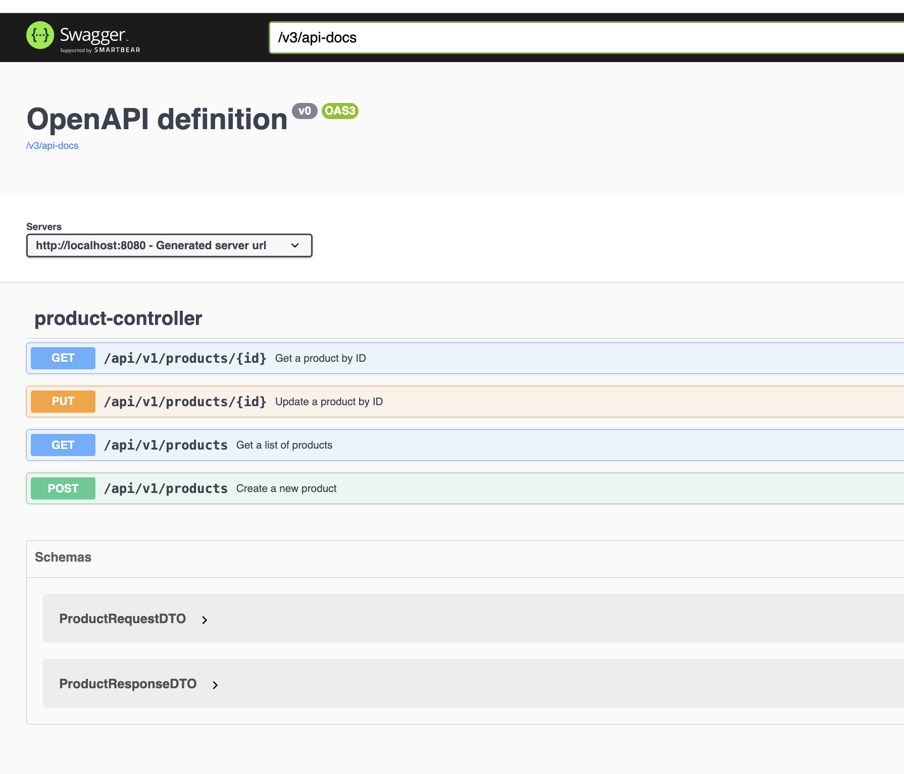

# Java DevOps Assignment

# 1. Assignment components

* **Spring Boot WebFlux:** A reactive, non-blocking framework for high scalability.
* **Reactor Core:** Implements reactive streams (Mono/Flux) for efficient asynchronous processing.
* **Spring Boot Data JPA:** Provides Spring Data JPA, Hibernate, and database connectivity.
* **Micrometer Core:** Centralized metrics collection for real-time monitoring.
* **Spring Boot Actuator:** Exposes health and management endpoints.
* **Resilience4j Spring Boot3:** Lightweight resilience patterns (e.g., circuit breaker, retry) for fault tolerance.
* **Springdoc OpenAPI WebFlux UI:** Auto-generates interactive API documentation for reactive APIs.
* **Spring Boot Test:** Provides comprehensive testing support.
* **Reactor Test:** Offers utilities for testing reactive streams.
* **Mockito JUnit:** Enables concise, behavior-driven mocking.
* **MockServer Netty:** Mocks HTTP interactions for reliable integration testing.
* **Testcontainers:** Provides lightweight instances of common databases or anything else that can run in a Docker container.
* **Docker:** Containerization platform for application deployment.
* **Maven:** Dependency management and build automation tool.
* **MySQL:** Relational database to store all products.

# 2. How to run application

There are multiple ways to run this application locally. The application was tested using `JDK 21`.

1. The following script will run the whole SpringBoot application including a MySQL database.

Script does the followings:
1. It makes sure that _docker_ and _docker-compose_ are installed on localhost, otherwise display error message.
2. Check if Maven installed (mvn) otherwise uses Maven wrapper.
3. Runs `mvn clean package -Dmaven.test.skip=true` command.
4. Stop existing containers (if running) using _docker-compose_.
5. Build the product-service Docker image.
6. Run the Docker container using _docker-compose_.

```bash 
chmod +x run-product-service-app.sh
./run-product-service-app.sh
```



2. By running the following commands.  

```bash
mvn clean package
```

and then:

```bash
docker-compose down -v && docker-compose up -d
```

In order to stop the application use the following:

```bash 
docker-compose down
```

# 3. How to Test the Application

You can use the following _Swagger UI_ to test the application on _localhost_:

[http://localhost:8080/webjars/swagger-ui/index.html](http://localhost:8080/webjars/swagger-ui/index.html)

You can try sending a **GET** request as shown below:

[http://localhost:8080/api/v1/products/1](http://localhost:8080/api/v1/products/1)



The application has also been deployed to the **AWS Cloud Provider**, so you can perform all these tests using the following URL as well:

[http://java-dev-ops-assignment.eu-north-1.elasticbeanstalk.com/webjars/swagger-ui/index.html](http://java-dev-ops-assignment.eu-north-1.elasticbeanstalk.com/webjars/swagger-ui/index.html)

The **AWS** deployment configuration also includes a **MySQL** instance.

# 4. Metrics

Actuator metrics show more details when the app starts with the profile as `dev` -> `-Dspring-boot.run.profiles=dev`

```bash 
docker-compose up
```
command will make sure that `dev` profile is used. Since `product-service` has environment variable as `- SPRING_PROFILES_ACTIVE=dev`

Some of the example endpoints:

http://localhost:8080/actuator  
http://localhost:8080/actuator/metrics  
http://localhost:8080/actuator/prometheus





# 5. API Documentation

* **API Docs:** [http://localhost:8080/v3/api-docs](http://localhost:8080/v3/api-docs)
* **Swagger UI:** [http://localhost:8080/webjars/swagger-ui/index.html](http://localhost:8080/webjars/swagger-ui/index.html)



# 6. Technology Justification

* **Docker:** Containerizes the Spring Boot application for deployment in container orchestration services like Kubernetes (k8s).
* **Spring WebFlux with Reactor Core:** Provides a non-blocking framework for high scalability when communicating with services.
* **Spring JPA with Hibernate:** Provides object-relational mapping, simplifying database interactions.
* **Resilience4j:** Introduces resiliency patterns, such as circuit breakers and retries, to enhance fault tolerance.
* **Micrometer:** Collects application metrics for later use in alerting and dashboarding.
* **Testcontainers:** Provides lightweight instances of databases, or anything that can run in a Docker container, greatly improving the quality and speed of integration tests.
* **Spring Boot Actuator:** Exposes health endpoints to facilitate application monitoring.

# Future Improvements

Due to time constraints on this assignment, some technical debt may have been introduced. The following improvements could be implemented:

* **Load Testing:** Introduce a load testing framework to evaluate application performance under intensive load.
* **Dashboards:** Implement dashboards using technologies like Grafana to visualize the collected metrics.
* **Enhanced Logging:** Improve overall logging throughout the application.
* **Environment-Specific Configuration:** Update configurations in the `application.yaml` files to accurately reflect each environment.
* **Full Non-Blocking Database Access:** Utilize Spring Data R2DBC to fully support non-blocking database access.
* **Authentication and Authorization:** Introduce authentication and authorization frameworks, such as JWT.

